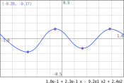

# QT-interp specification
The goal of qt-interp is to be an interactive program demonstrating the
interpolation of data points on a 2D graph by polynomials. The points are
draggable by the user.

## Screens
The main screen is:

The layers, background to foreground visibility and object labels are specified
by the object tree in the file [main-screen](main-screen.svg) (and easily
consulted using Inkscape).

### Description
* The main screen is a graph view with axes, grid and ticks on its border.
* The scale is the same in x and y axes.
* Points are displayed on the graph.
* An interpolation curve goes through the points.
* The formula corresponding to the interpolation polynomials is displayed at
  below the graph.
* A box in a graph corner displays the coordinates of a point.

## Behaviour
* The window size is fixed. It is meant to be displayed as a floating window.
* The graph area boundaries are fixed.
* Points can be dragged individually with the mouse.
  * The movement of points is limited to a box that is the intersection of:
    the graph area, the x coordinates of previous and next point if any.
  * Two points cannot switch order with respect to x coordinates.
  * Two points cannot share the same x coordinate, an epsilon value is hardcoded
    to prevent this.
* The `point_coords` box is only visible when the user is mouse hovering a point
  or dragging a point.
* `interp_curve` and `interp_formula` are updated in real time, including when
  the user is in the process of dragging a point.
