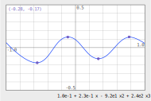

# QT-interp specification
The goal of qt-interp is to be an interactive program demonstrating the
interpolation of data points on a 2D graph by polynomials. The points are
draggable by the user.

## Screens
The main screen is:

We refer to the different parts by their label:

TODO: main screen with labels.

### Description
* The main screen is a graph view with axes, grid and ticks on its border.
* The scale is the same in x and y axes.
* Points are displayed on the graph.
* An interpolation curve goes through the points.
* The formula corresponding to the interpolation polynomials is displayed at
  below the graph.
* A box in a graph corner displays the coordinates of a point.

### Layering

## Behaviour

